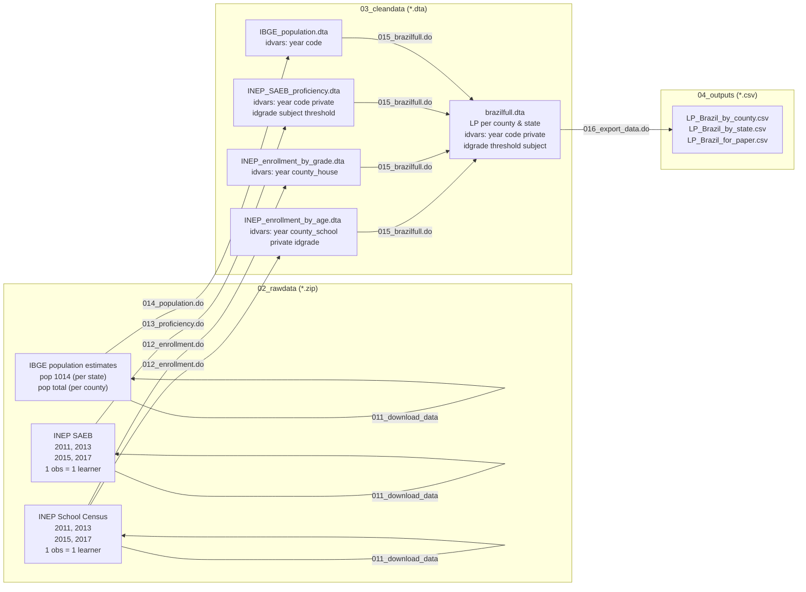

# How this repo is structured
back to the [README](https://github.com/dianagold/LearningPovertyBrazil/blob/master/README.md) :leftwards_arrow_with_hook:

## General structure

All code needed to process and copy input data sets to the local clone, and to generate all datasets from them are shared through this repository. Sub folders that would start empty - without any files that we wish to track in the repo - will have a placeholder markdown file, just to synchronize the folder structure, for GitHub would ignore a folder if completely empty.

In this repo we calculate learning poverty in Brazil (brazilfull) at the county, state and country level - for various years. It runs exclusively in Stata.

| Sub-Folder Name | Usage |
|---|---|
|**00_documentation**|This folder has .md and other documentation files.|
|**01_programs**|Programs that compile all data on learning poverty in Brazil|
|**02_rawdata**|This folder starts empty, except for placeholder.md files. Its subfolders correspond to the data sources used - each containing a download subfolder where .zip files with the rawdata are downloaded, then unzipped.|
|**03_cleandata**|This folder starts empty. It will store the clean .dta files, including the brazilfull.dta.|
|**04_outputs**|This folder starts empty. It will store the exported outputs, such as csv and graphs.|

All the data needed for this project is downloaded on the fly by the program `011_download_data.do`, from a public Dropbox folder or from the WB network (in case the user is connected to it). Those .zip files are first unzipped into `02_rawdata/`, then combined into intermediate datasets. Population, enrollment and proficiency datasets are created in `03_cleandata/`, then combined into brazilfull.dta, also stored in `03_cleandata/`. Finally, we export some csv files into `04_outputs/` according to other data demands.

### Technical note on the rawdata

To calculate Learning Poverty in Brazil, we rely on harmonized multi-year data from the Brazilian Institute of Education Statistics (INEP), which can be downloaded and accessed through the _edubra_ package. The latest version of _edubra_ and installation instructions can be found in the [EduBra repo](https://github.com/dianagold/edubra).

### Generating flowcharts

The above flowchart was generated from text in a similar manner as markdown, through _mermaid_.

To update the chart, you can use the [mermaid live editor](https://mermaidjs.github.io/mermaid-live-editor/). Pasting the code in this page in the live editor will render the images displayed in this page.

As of now, the GitHub markdown renderer does not support _mermaid_, which is why the rendering can only be done by statically saving the _.png_ files in the repo. But this is a [feature that has been requested](https://github.community/t5/How-to-use-Git-and-GitHub/Feature-Request-Support-Mermaid-markdown-graph-diagrams-in-md/td-p/21967) and may one day be added to GitHub.  

##### Flowchart of code

