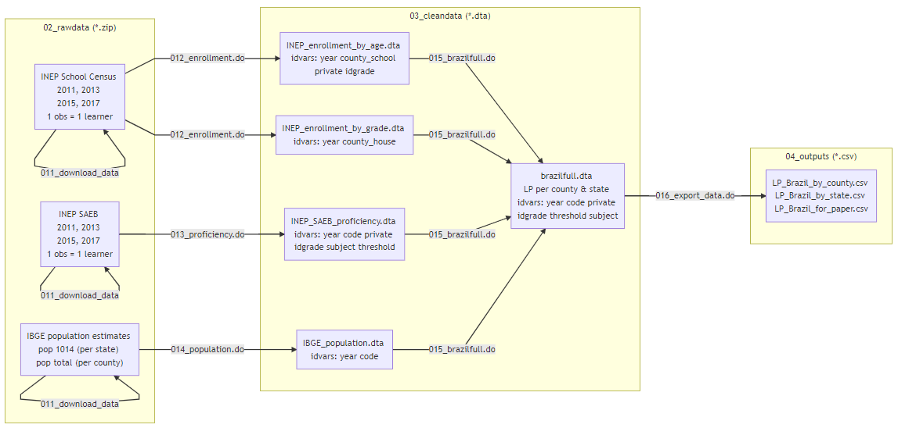

# LearningPovertyBrazil

This repository replicates the World Bank indicator that combines schooling and learning - Learning Poverty - for Brazil at the subnational level (counties and states).

For more information on the original indicator and its calculation at the national level, please check the [**Learning Poverty repo**](https://github.com/worldbank/LearningPoverty) and the corresponding technical paper [1].

[1] Azevedo, J.P., and others. 2019. _“Will Every Child Be Able to Read by 2030? Why Eliminating Learning Poverty Will Be Harder Than You Think, and What to Do About It.”_ World Bank Policy Research Working Paper series. Washington, DC: World Bank.

## Technical notes

To calculate Learning Poverty in Brazil, we rely on harmonized multi-year data from the Brazilian Institute of Education Statistics (INEP), which can be downloaded and accessed through the _edubra_ package. The latest version of _edubra_ and installation instructions can be found in the [EduBra repo](https://github.com/dianagold/edubra).

We also use data from the Brazilian Institute of Geography and Statistics (IBGE), notably population estimatives and shapefiles of administrative boundaries.

More information and links to all sources is available in the [Data Sources note](https://github.com/dianagold/LearningPovertyBrazil/blob/master/00_documentation/Data_Sources.md).  

The figure below summarizes how we process all the data, a process further detailed in the [Repo Structure note](https://github.com/dianagold/LearningPovertyBrazil/blob/master/00_documentation/Repo_Structure.md).  

[migration] all files originally at repo dianagold/LearningPovertyBrazil
